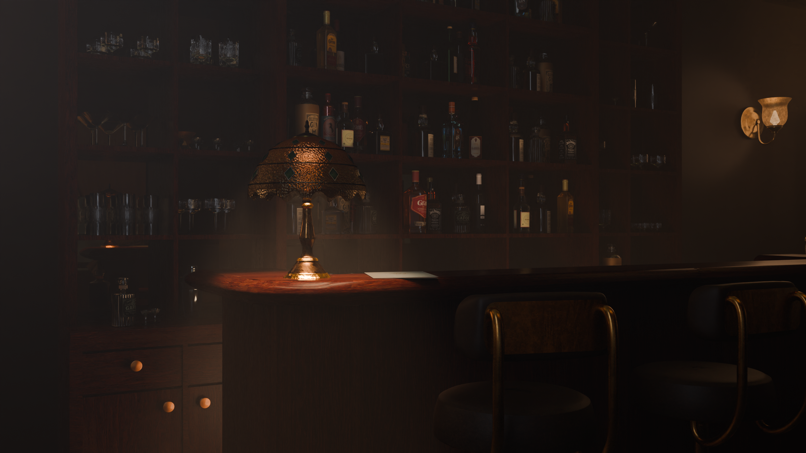
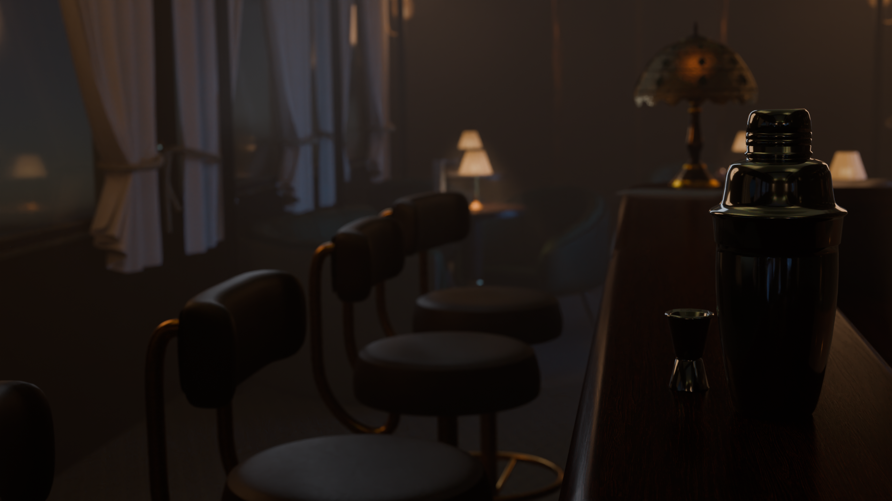
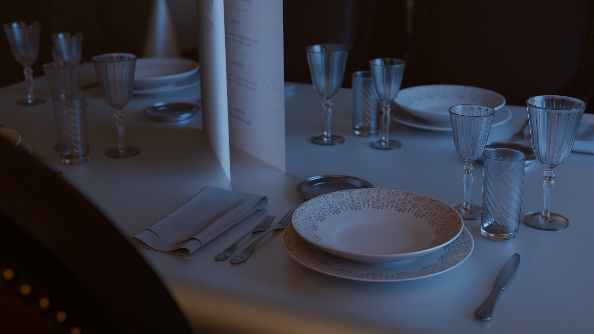
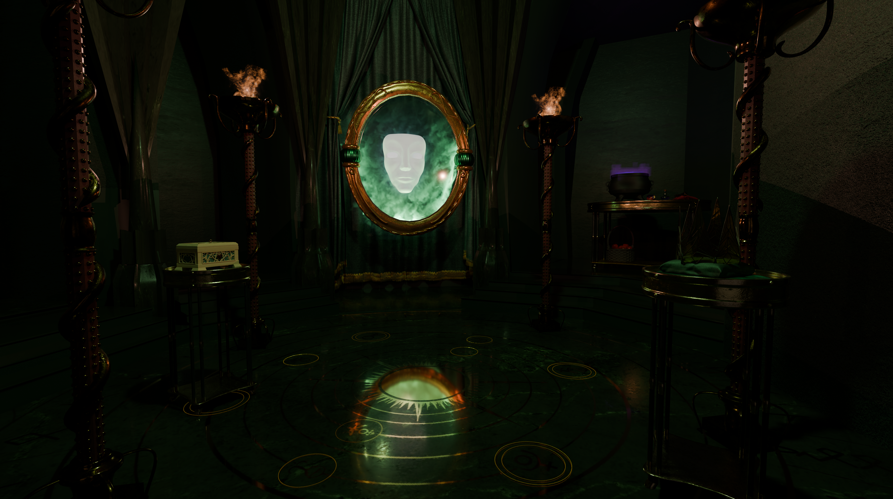
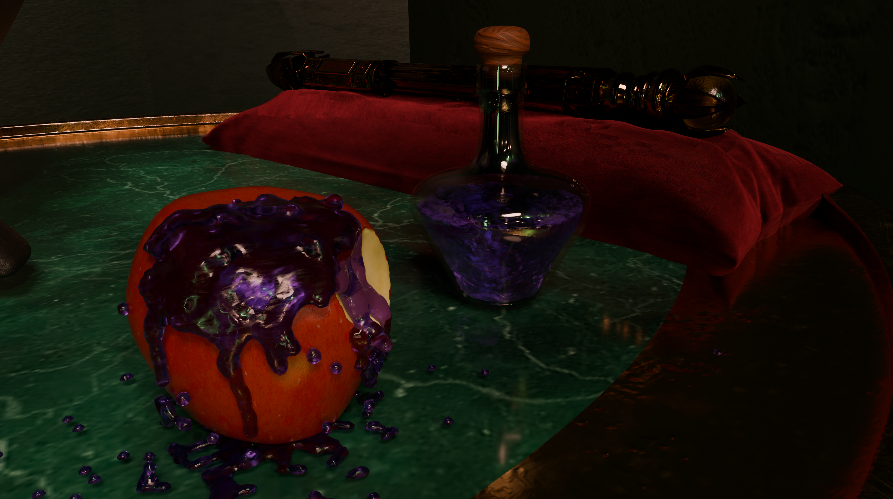

# 3D Environments & Character Animation

A selection of academic projects developed in Blender, spanning photorealistic environment design, simulation-driven storytelling and stop-motion-inspired character animation.

## Orient Express Reimagined

### Photorealistic 3D environment

This project reimagines the interior of the Orient Express as a single train carriage shared by a bar and a restaurant. The central bar counter separates the two functions while keeping the space visually coherent.

The main objective was **photorealism**: building a believable interior through careful modelling, material work, composition and soft early-morning lighting. The project explores how light, surface detail and spatial layout can create an atmospheric environment that feels lived in.

**Tools:** Blender · Adobe Substance 3D Painter
**Focus:** Photorealism · Environment design · Lighting · Materials · Composition

  
  

  
  

## Maleficent's Room

### Stylised environment & Blender simulations

A stylised reinterpretation of Maleficent's room, inspired by the visual language of a Disney live-action film. Rather than aiming for strict reproduction, the project uses the room as a setting for experimenting with Blender's creative and simulation tools.

The scene was built around effects that contribute to its magical, threatening atmosphere:

- **Fire and smoke** created through Blender's simulation tools.
- **A bitten apple** modelled with a **Boolean operation**.
- **Golden floor particles** generated with a particle system.
- **Poisoned liquid** created with a fluid simulation for the apple.
- **Apple basket** animated using rigid-body physics.
- **Mask in the mirror** sculpted in Blender.

**Tools:** Blender
**Focus:** Particle systems · Physics simulations · Fluids · Rigid bodies · Sculpting · Lighting

  
  

## PETCO — Stop-Motion Animation Recreation

### Character animation · Computer Animation course

For the Computer Animation course, our team recreated a 30-second segment of a [PETCO advertisement](https://youtu.be/c4_qb2GJACg?si=tpvkBNO_MMDlwXOB). The exercise focused exclusively on **character animation** and on recreating the handmade rhythm of stop-motion, rather than on producing an official PETCO campaign.

🎬 **[Watch our final animation — MP4, 40 MB](petco-animation.mp4)**

### Animation approach

- **Armatures** for character rigging and animation.
- **Dynamic Paint** for the notebook interaction and the characters' footprints in snow.
- **Particle systems** for falling snow.
- **Real Snow** add-on to build the snow-covered ground.
- **Hair system** to reproduce the felt texture of the characters.
- A **Step modifier set to 2** to give the movement the distinctive reduced-frame-rate feel of stop-motion.

**Tools:** Blender · Real Snow add-on
**Focus:** Character rigging · Animation · Dynamic Paint · Particle systems · Stop-motion timing
