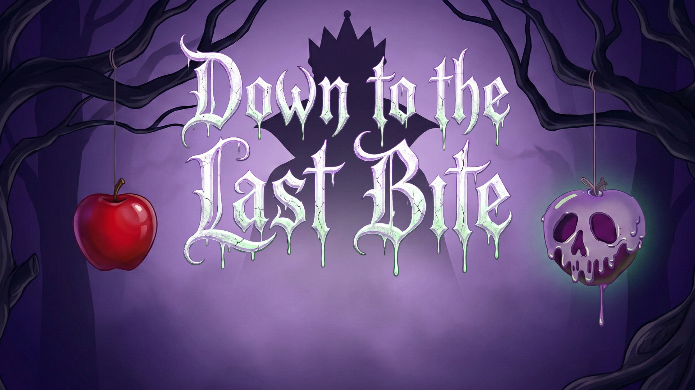

# Down To The Last Bite

### Computer Graphics course project · C++ · OpenGL

An interactive 3D game inspired by the world of *Snow White*. The project was developed for a Computer Graphics course, with the primary goal of building a complete real-time graphics application in C++ and OpenGL.

  

## Project overview

The player moves across three lanes to collect beneficial falling objects and avoid poisoned apples. The gameplay is intentionally simple: it provides a focused context for exploring the technical systems behind a game, rather than being the project’s main point of complexity.

The work brings together real-time rendering, 3D assets, input, sound and interface design into a single playable experience.

## Graphics & interaction

- **OpenGL rendering pipeline** with custom vertex and fragment shaders.
- **3D model loading and rendering** for the player, apples, masks, mirrors and other game objects.
- **Camera, lighting, transformations and blending** for the game scene.
- **Game states** for the menu, gameplay, game-over animation, name entry and leaderboard.
- **2D interface and text rendering** for buttons, score and lives.
- **Audio system** with music and sound effects.
- Real-time object spawning, collision handling, score tracking and short gameplay events.

## Technologies

**C++14 · OpenGL 3.3 · GLFW · GLAD · GLM · Assimp · FreeType · OpenAL · libsndfile · CMake**

## Explore the project

- [Application entry point](OpenGLApp/Main.cpp)
- [Game loop and view controller](OpenGLApp/ViewController/MainViewController.cpp)
- [Rendering and game data classes](OpenGLApp/DataClasses)
- [Runtime assets](OpenGLApp/resources)
